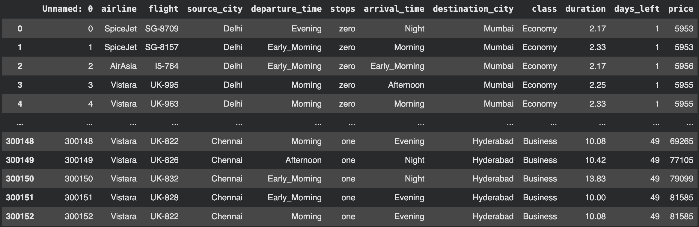
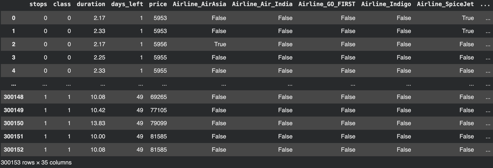
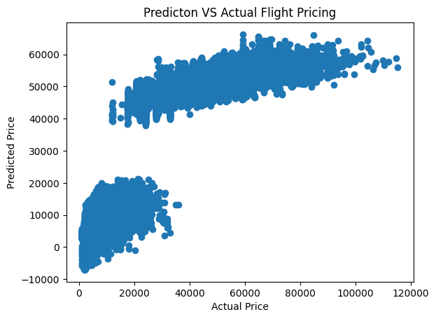
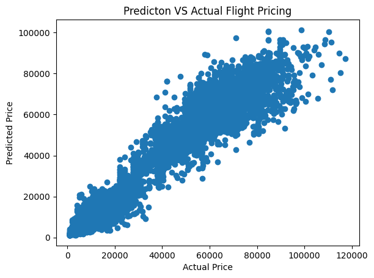

<h1 align="center">✈️ Airline Fare Predictor (Regression Models)</h1>

A machine learning project focused on predicting airline ticket prices using regression techniques.

<h2>📌 Project Overview</h2>

Flight ticket prices fluctuate due to multiple dynamic factors like demand, timing, airline, and route.
This project analyzes historical data and builds regression models to predict ticket prices accurately.

<ul>
  <li>Analyze historical flight data</li>
  <li>Identify key features affecting ticket prices</li>
  <li>Build and evaluate regression models</li>
  <li>Predict airfare with optimal accuracy</li>
</ul>

<h2>🎯 Objectives</h2>
<ul>
  <li>Perform Exploratory Data Analysis (EDA)</li>
  <li>Apply data preprocessing & feature engineering</li>
  <li>Train multiple regression models</li>
  <li>Compare model performance</li>
  <li>Identify important features affecting airfare</li>
</ul>

<h2>📊 Dataset</h2>

The dataset includes the following features:

<ul>
  <li>Airline</li>
  <li>Source & Destination</li>
  <li>Departure & Arrival Time</li>
  <li>Duration</li>
  <li>Total Stops</li>
  <li><b>Price (Target Variable)</b></li>
</ul>

<h2>⚙️ Project Workflow</h2>

<pre>
Data Collection → Data Cleaning → EDA → Feature Engineering → Model Training → Evaluation → Prediction
</pre>

<h2>🧠 Models Used</h2>
<ul>
  <li>Linear Regression</li>
  <li>Decision Tree Regressor</li>
  <li>Random Forest Regressor</li>
  <li>(Add more if used: XGBoost, etc.)</li>
</ul>

<h2>📈 Evaluation Metrics</h2>
<ul>
  <li>Mean Absolute Error (MAE)</li>
  <li>Mean Squared Error (MSE)</li>
  <li>Root Mean Squared Error (RMSE)</li>
  <li>R² Score</li>
</ul>

<h2>🔍 Key Insights</h2>
<ul>
  <li>Ticket prices vary significantly across airlines</li>
  <li>Last-minute bookings increase prices</li>
  <li>Flight timing and duration impact fares</li>
  <li>Routes strongly influence pricing</li>
</ul>

<h2>🛠️ Tech Stack</h2>
<ul>
  <li><b>Language:</b> Python</li>
  <li><b>Libraries:</b> pandas, numpy, matplotlib, seaborn, scikit-learn</li>
  <li><b>Environment:</b> Jupyter Notebook</li>
</ul>

<h2>📂 Project Structure</h2>

<pre>
Airline_FarePredictor_RegressionModels/
│
├── data/                  
├── notebooks/            
├── models/               
├── src/                  
├── requirements.txt      
└── README.md             
</pre>

<h2>🚀 How to Run</h2>

<ol>
  <li>Clone the repository</li>
</ol>

<pre>
git clone https://github.com/Browniesauce/Airline_FarePredictor_RegressionModels.git
cd Airline_FarePredictor_RegressionModels
</pre>

<ol start="2">
  <li>Install dependencies</li>
</ol>

<pre>
pip install -r requirements.txt
</pre>

<ol start="3">
  <li>Run Jupyter Notebook</li>
</ol>

<pre>
jupyter notebook
</pre>

<h2>🗃️ Raw Data Set</h2>

<h2>🗃️ Processed Data Set</h2>

<h2> 🔍 Analysis </h2>
<ul>
    <li>Linear Regression Prediction Model 
 </li>
    <li>Random Forest Regression Prediction Model 
  </li>
    <li>Random Forest Regression Prediction Model with Hyper Parameter Tunning 
 </li>
</ul>

<h2> 🧠 Model outcomes </h2>
<ul>
  <li>Linear Regression Model R2 Score: 0.9087260028470203 </li>
  <li>Random Forest Regression Model R2 Score: 0.9856588168395194</li>
  <li>Random Forest Regression Model with Hyperparameter Tunning R2 Score: 0.9860832731688068</li>
</ul>

<h2>🏁 Conclusion</h2>

 this project successfully demonstrates the effectiveness of machine learning techniques in predicting airline ticket prices. Among the models evaluated, the Random Forest Regressor significantly outperformed Linear Regression, achieving an R² score of 0.9856, while further hyperparameter tuning provided a slight improvement to 0.9860. These results highlight the importance of using ensemble methods and optimization techniques for capturing complex, non-linear relationships in airfare data, making the model highly reliable for practical prediction tasks.

<h2>📌 Future Improvements</h2>
<ul>
  <li>Deployment using Flask / Streamlit</li>
  <li>Real-time data integration</li>
  <li>Advanced models (XGBoost, LightGBM)</li>
</ul>
